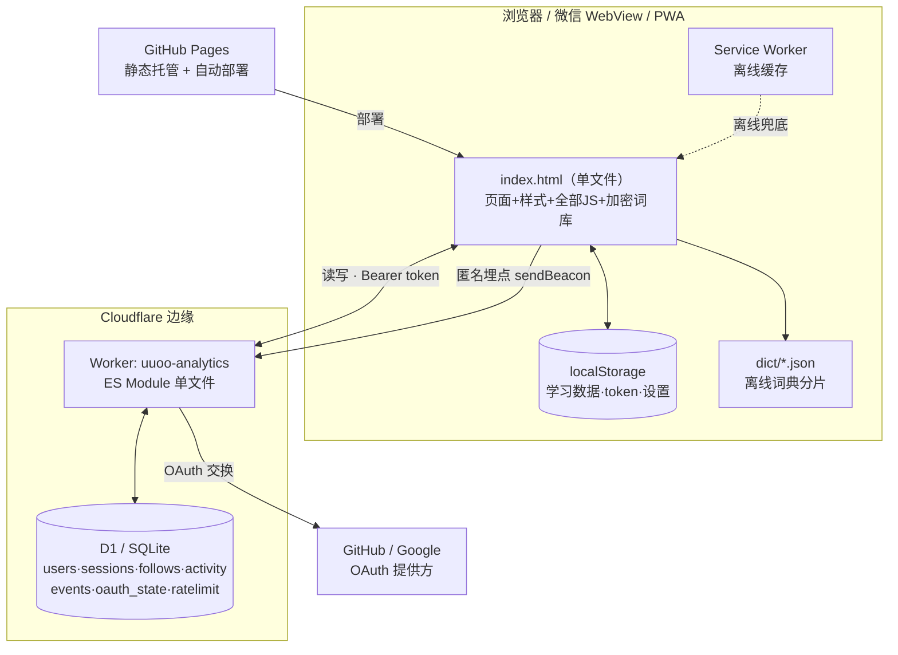
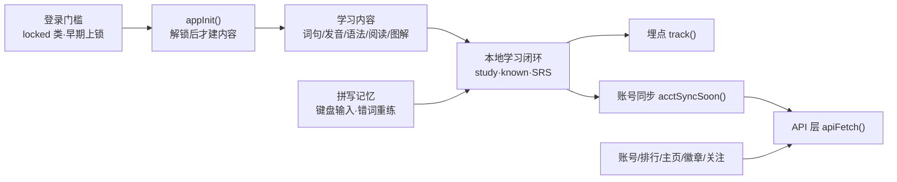
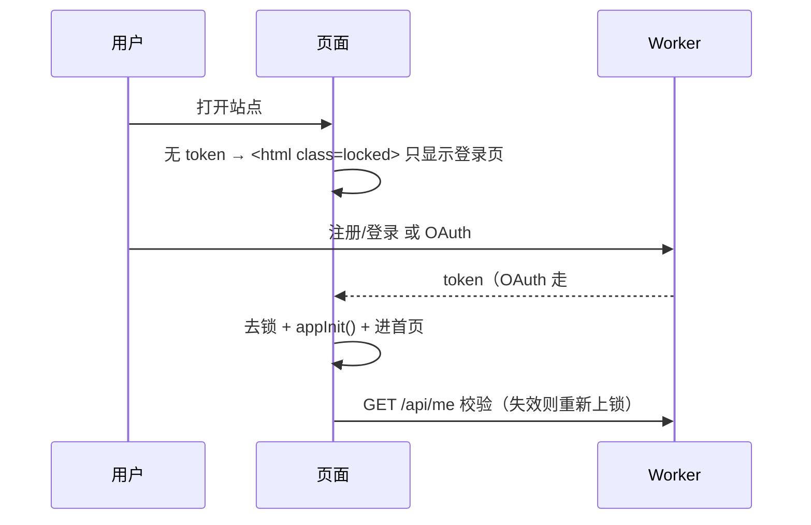
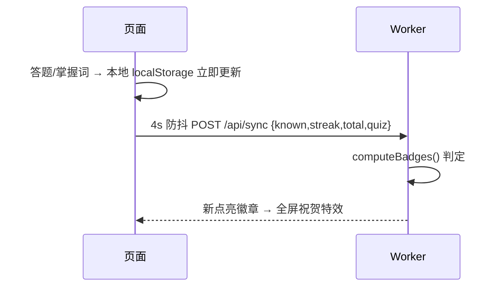
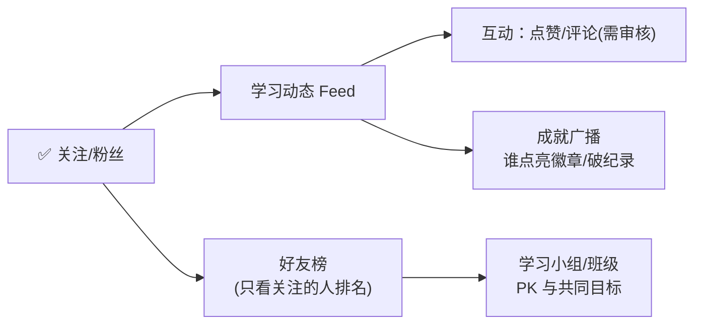

# uuoo 架构设计（德语学习手册 → 社交学习）

> 一句话：**纯静态单文件前端（GitHub Pages）+ 一个 Cloudflare Worker + 一个 D1（SQLite）**。
> 前端离线可用、微信可用；后端只做「账号 / 学习数据 / 社交 / 匿名埋点」这类必须联网的事。

---

## 1. 全景图



**核心取舍**：前端是「真值+离线」，后端是「共享状态」。没有账号也能学（本地）；登录后学习数据才上云、参与社交。

---

## 2. 分层

| 层 | 技术 | 职责 |
|---|---|---|
| 表现层 | 单文件 `src.html` → `build.mjs` → `index.html` | 页面/交互/本地学习闭环，全部内联，离线可跑 |
| 构建层 | `build.mjs`（Node + terser） | 注入词库 → XOR/Base64 加密 + 懒解密 + 混淆 → 生成 `index.html` + `sw.js` |
| 边缘服务层 | Cloudflare Worker（ES Module） | 账号鉴权、学习数据同步、徽章判定、社交、匿名埋点 |
| 数据层 | Cloudflare D1（SQLite） | 用户/会话/关注/事件持久化 |
| 托管/部署 | GitHub Pages（前端）+ wrangler（后端） | push main 自动发前端；`deploy.sh` 一键发后端 |

---

## 3. 数据模型（D1）

```mermaid
erDiagram
  users ||--o{ sessions : "1:N 登录会话"
  users ||--o{ follows  : "follower"
  users ||--o{ follows  : "followee"
  users {
    int id PK
    text username UK "小写字母数字下划线"
    text nickname
    text pass_salt "PBKDF2 盐(OAuth为空)"
    text pass_hash "PBKDF2 哈希"
    text provider "pw/github/google"
    text provider_id
    text avatar "emoji(白名单)"
    text av_bg  "色值(白名单)"
    text sig    "个性签名<=60"
    int  known "掌握词数"
    int  best_streak "最长打卡"
    int  total "累计学习"
    int  quiz  "累计答题"
    text badges "已点亮徽章CSV(服务端判定)"
  }
  sessions { text token PK; int uid; int exp }
  follows  { int follower; int followee; int ts }
  events   { int id PK; int ts; text vid; text name; text props "匿名埋点" }
  oauth_state { text state PK; int exp "防CSRF" }
  ratelimit { text k PK "动作:标识"; int cnt; int exp "固定窗口频控" }
```

**要点**
- 学习统计（known/best_streak/total/quiz）**冗余存在 users 行**上 → 排行榜/徽章一次查询即得，无需聚合。
- 徽章是**服务端判定并落库**（`badges` 字段），前端只渲染，杜绝改本地刷徽章。
- 埋点 `events` 与账号**同库不同表**，且只存匿名 vid，不与 users 关联。
- `ratelimit` 为固定窗口频控计数（键形如 `reg:IP` / `lgf:IP` / `lgu:用户名`），过期行由 Worker 顺带清理。

---

## 4. API 契约（Worker 路由）

| 方法 · 路径 | 鉴权 | 作用 |
|---|---|---|
| `POST /collect` · `GET /stats` | 无 / 密钥 | 匿名埋点写入 / 统计查询 |
| `POST /api/register` `/api/login` | 无 | 注册 / 登录 → 发 token |
| `GET /api/oauth/{github\|google}/{start\|callback}` | 无 | 第三方登录（token 走 URL 片段回跳） |
| `POST /api/sync` | Bearer | 上报学习数据 → 判定徽章 |
| `GET /api/me` | Bearer | 自己的资料 + 排名 + 关注数 |
| `POST /api/profile/update` | Bearer | 改昵称/头像/背景/签名（白名单校验） |
| `GET /api/leaderboard?by=` | 无 | 三榜 Top50 |
| `GET /api/profile?name=` | 可选 | 公开主页（带 token 时含 isFollowing） |
| `POST /api/follow` `/api/unfollow` · `GET /api/following` | Bearer | 关注 / 取关 / 关注列表 |
| `POST /api/account/password` | Bearer | 改密码（验旧密码；成功后踢除当前外全部会话） |
| `POST /api/account/delete` | Bearer | 注销账号（密码 / `confirm` 验证；硬删 users·sessions·follows·activity） |
| `POST /api/logout` | Bearer | 登出当前会话（幂等） |
| `POST /api/logout_all` | Bearer | 踢除当前外全部会话 |

**鉴权模型**：随机不透明 token（192bit）存 `sessions`，`Authorization: Bearer`。**无 Cookie → 无 CSRF**；CORS `*` 因此安全。

---

## 5. 前端模块（src.html 内逻辑分区）



**性能关键**：硬门槛下未登录首屏只渲染登录页，`appInit()`（建词库列表等重活）推迟到解锁后 → 登录页 FCP 减半。

---

## 6. 关键数据流

**登录门槛**


**学习数据同步**（本地优先，最终一致）


---

## 7. 设计原则与约束

- **本地优先**：学习不依赖网络；账号是「增强」，断网/未登录仍能用（登录门槛是产品选择，非技术必需）。
- **服务端是数值真值**：徽章、排名只认服务端；前端不可信。
- **零信任输入**：昵称/签名去控制字符+限长；头像/颜色白名单；所有渲染 `_esc()` 转义防 XSS；SQL 全参数化。
- **离线/微信兼容**：ES5 垫片、无外链资源、Web Audio 本地合成音效、Service Worker 缓存。
- **单 Worker 单 D1**：个人站规模够用，运维最简；埋点与账号逻辑分表隔离。

**安全审计留档（2026-07，建议级，非阻塞）**
- 鉴权取 token 仍保留 `?token=` 查询参数兜底（历史兼容）：URL 可能进日志/Referer，前端全量改用 Bearer 头后应移除。
- `ratelimit` 过期行目前在请求路径顺带 DELETE 清理，够用；若表膨胀可改 Cron Trigger 定期清理（可选）。
- `lgu`（按用户名计失败）存在「他人恶意输错致真用户暂时被锁」的权衡：当前 10 次/10 分钟窗口短、影响可控，且能挡定向爆破；如误锁投诉增多，可为「已登录会话改密」放宽或改验证码。

---

## 8. 演进路线：社交学习

已具备：账号 · 资料 · 三榜 · 徽章（含创始人）· **关注关系**。下一步按「小步、可独立发布」推进：



**建议的下一块：学习动态 Feed（低风险、高粘性）**
- 新表 `activity(id, uid, type, data, ts)`；在 `/api/sync` 判定出**新徽章/破纪录**时写一条。
- `GET /api/feed` = 关注对象的 activity，按时间倒序分页（`WHERE uid IN (我关注的) ORDER BY ts DESC`，`follows.follower` 已建索引）。
- 纯系统生成事件（升级/徽章/上榜）→ **无 UGC、无审核负担**，与「排行榜+徽章」同属绿色区。
- 「好友榜」几乎零成本：排行榜 SQL 加 `WHERE id IN (我关注的+我)`。

**再往后（需谨慎）**
- 点赞：轻，加 `likes` 表即可。
- 评论/留言：**UGC → 触发内容审核法定义务**，要做敏感词过滤 + 举报 + 处置，工程与合规成本高，建议最后做或先不做。
- 学习小组/班级 PK：`groups` + `group_members`，榜单按组聚合。

**架构层面的注意**
- Feed 规模变大后：D1 单表分页够用到万级用户；再大可加 `activity` 归档或读扩散缓存（KV）。
- 滥用防护：注册/登录/验密已有 `ratelimit` 表频控（见 §3）；关注等社交写接口的频控上量前再补（可复用同一机制或 Turnstile）。
- 若账号量级增长，可把「匿名埋点」拆到独立 Worker/DB，与账号彻底隔离（现为一体，便于运维）。

---

## 9. 部署

- **前端**：改 `src.html` → `node build.mjs` → 提交 `index.html`/`sw.js` → push `main` → GitHub Pages 自动上线。
- **后端**：改 `analytics/*` → 用户侧 `bash deploy.sh`（拉最新代码 → `d1 execute schema.sql --remote` 建/补表 → `wrangler deploy`）。
- **密钥**：`STATS_KEY` / `GH_CLIENT_SECRET` / `GOOGLE_CLIENT_SECRET` 用 `wrangler secret`，不入库不入仓。
